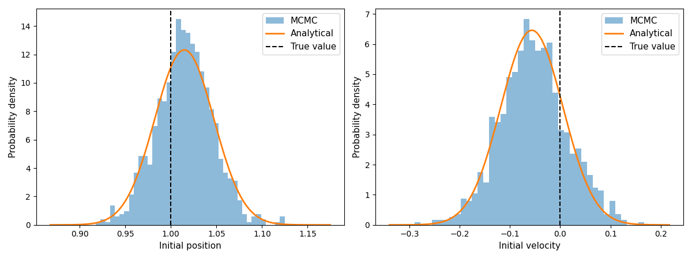

# Bayesian estimation of initial conditions

This tutorial demonstrates how `pardax` can be used with
[blackjax](https://github.com/blackjax-devs/blackjax) to solve a
Bayesian inverse problem.

**Aim:** Infer some initial conditions $u_0 = u(\cdot, t=t_0)$ of a PDE from
some noisy observations of $u(\cdot, t)$ at a later time $t > t_0$.

**Note:** This tutorial requires the following additional packages:

- `blackjax`
- `matplotlib`
- `scipy`

## Problem statement

We use the simple harmonic oscillator (SHO) as our forward model.
The state $u = [x, v]$ evolves as
$$
\frac{dv}{dt} = -\omega^2 x,
$$
where $x$ is the position of the oscillator, $v := \frac{dx}{dt}$ is the velocity
and $\omega$ is a known angular frequency.
The above equations have an analytical solution,
$$
x(t) = x(0)\cos(\omega t) + \frac{v(0)}{\omega}\sin(\omega t),
$$
which we will use later to verify the recovered initial condition.

In our setup, we are given some noisy measurements of the position
$$
m_i = x(t_i;\, u_0) + \epsilon_i
$$
at times $t_i > t_0$, where $i = 1, \ldots, N$ and the noise terms $\epsilon_i \sim \mathcal{N}(0, \delta^2)$ are identically and independently distributed.
The task is to infer the initial condition $u_0 = [x(0),\, v(0)]$ from the set of measurements $\{m_i\}$.

Since the analytical solution is linear in $u_0$, we can write all measurements compactly as
$$
m = A u_0 + \epsilon, \qquad \epsilon \sim \mathcal{N}(0, \delta^2 I),
$$
where $A \in \mathbb{R}^{N \times 2}$ is the observation matrix with rows
$$
A_i = \left[\cos(\omega t_i),\; \frac{\sin(\omega t_i)}{\omega}\right].
$$

## Bayesian inference

From Bayes' theorem, the posterior probability density
$\pi^m(u_0) := \pi(u_0 \mid m)$
is given by
$$
\pi^m(u_0)
=
\frac{\rho(m \mid u_0)\; \pi(u_0)}{\displaystyle\int \rho(m \mid u_0')\; \pi(u_0')\, \mathrm{d}u_0'},
$$
where $\pi(u_0)$ is the prior probability density and
$\rho(m \mid u_0)$ is the likelihood.
Directly evaluating the integral in the denominator is typically intractable,
so we will draw samples from $\pi^m$ using Markov Chain Monte Carlo (MCMC) instead.

Let the prior be a Gaussian centred at zero, i.e.,
$$
\pi(u_0) \propto \exp\left(-\frac{\|u_0\|^2}{2\sigma^2}\right),
$$
where $\sigma^2$ is the prior variance.
With the observation model $m = Au_0 + \epsilon$ and $\epsilon \sim \mathcal{N}(0, \delta^2 I)$,
the likelihood becomes
$$
\rho(m \mid u_0)
\propto
\exp\left(-\frac{\|m - Au_0\|^2}{2\delta^2}\right)
$$
and the posterior is
$$
\pi^m(u_0)
\propto
\exp\left(-\frac{\|m - Au_0\|^2}{2\delta^2} - \frac{\|u_0\|^2}{2\sigma^2}\right).
$$
The logarithm of the above posterior is what we will pass to one of `blackjax`'s samplers.

## Analytical solution

By completing the square, the posterior density can be written as
$$
\pi^m(u_0) \propto \exp\left( (u_0 - \mu)^\top \Sigma^{-1} (u_0 - \mu) \right),
$$
where
$$
\Sigma^{-1} = \frac{1}{\sigma^2} I + \frac{1}{\delta^2} A^\top A,
\qquad
\mu = \frac{1}{\delta^2} \Sigma A^\top m.
$$
Thus, we have a closed-form expression for the posterior,
$$
u_0 \mid m \;\sim\; \mathcal{N}\left(\mu,\, \Sigma\right)
$$
which can be used to check the numerical solution.

## 1. Forward model

```python notest
import jax
import jax.numpy as jnp

omega = 2.0  # angular frequency

def sho_rhs(t, u, omega):
    """Right-hand side of the SHO: du/dt = [v, -omega^2 * x]."""
    x, v = u
    return jnp.array([v, -omega**2 * x])
```

## 2. Generating synthetic observations

We pick a true initial condition, integrate forward, and add Gaussian
noise to the position.

```python notest
import pardax as pdx

u0_true = jnp.array([1.0, 0.0])

t_span = (0.0, 3.0)
dt = 5e-2

t_out, u_out = pdx.solve_ivp(
    sho_rhs,
    t_span=t_span,
    y0=u0_true,
    stepper=pdx.RK4(),
    step_size=dt,
    params=omega,
    num_checkpoints=19,  # number of intermediate observations
)

# drop the initial condition from the output
t_out = t_out[1:]
u_out = u_out[1:]

# Add noise to the observations
key = jax.random.key(0)
delta = 0.1  # standard deviation of the noise
n_obs = len(t_out)
t_obs = t_out.copy()
x_obs = u_out[:, 0] + delta * jax.random.normal(key, shape=(n_obs,))
```

## 3. Log-posterior

Taking the log of the unnormalised posterior and choosing a scalar prior
variance $\sigma^2$, we implement
$$
\log \pi^m(u_0) 
\propto 
-\frac{\|m - Au_0\|^2}{2\delta^2} - \frac{\|u_0\|^2}{2\sigma^2}
$$

```python notest
sigma = 2.0  # prior standard deviation

def forward(u0):
    """Run the forward model and return predicted positions."""
    _, u_hat = pdx.solve_ivp(
        sho_rhs,
        t_span=t_span,
        y0=u0,
        stepper=pdx.RK4(),
        step_size=dt,
        params=omega,
        num_checkpoints=n_obs-1,
    )
    return u_hat[1:, 0]  # positions at observation times

def log_posterior(u0):
    x_pred = forward(u0)
    log_lik = -0.5 * jnp.sum((x_obs - x_pred) ** 2) / delta**2
    log_prior = -0.5 * jnp.sum(u0**2) / sigma**2
    return log_lik + log_prior
```

Because `solve_ivp` uses `jax.lax.scan` internally, `jax.grad` can
differentiate through the entire forward integration:

```python notest
grad_fn = jax.grad(log_posterior)
g = grad_fn(jnp.zeros(2))
assert g.shape == (2,)
```

## 4. MCMC with blackjax NUTS

NUTS (No-U-Turn Sampler) is a gradient-based MCMC algorithm that adapts
its trajectory length automatically. We use `window_adaptation` to tune
the step size during a warmup phase, then draw samples.

```python notest
import blackjax

rng_key = jax.random.key(1)
initial_position = jnp.zeros(2)

# Warmup iterations to tune the step size
warmup = blackjax.window_adaptation(blackjax.nuts, log_posterior)
rng_key, warmup_key = jax.random.split(rng_key)
(state, params), _ = warmup.run(warmup_key, initial_position, num_steps=500)

nuts = blackjax.nuts(log_posterior, **params)

def one_step(state, rng_key):
    state, _ = nuts.step(rng_key, state)
    return state, state

rng_key, sample_key = jax.random.split(rng_key)
keys = jax.random.split(sample_key, 1000)
_, states = jax.lax.scan(one_step, state, keys)
samples = states.position  # shape (1000, 2)
```

## 5. Analysing the results

We compare the MCMC results with the analytical posterior:

```python notest
x0_samples = samples[:, 0]
v0_samples = samples[:, 1]

print("True initial condition:")
print(f"  x(0) = {u0_true[0]:.3f},  v(0) = {u0_true[1]:.3f}")

print("\nNumerical (MCMC) results:")
print(f"  Posterior mean:  x(0) = {x0_samples.mean():.3f},  v(0) = {v0_samples.mean():.3f}")
print(f"  Posterior std:   x(0) = {x0_samples.std():.3f},  v(0) = {v0_samples.std():.3f}")

# Build the observation matrix A (shape: n_obs x 2)
A = jnp.stack([jnp.cos(omega * t_obs), jnp.sin(omega * t_obs) / omega], axis=1)

cov_post = jnp.linalg.inv(
    (1.0 / delta**2) * (A.T @ A)
    +
    (1.0 / sigma**2) * jnp.eye(2)
)

mean_post = (1.0 / delta**2) * cov_post @ A.T @ x_obs

print("\nAnalytical results:")
var_post = jnp.sqrt(jnp.diag(cov_post))
print(f"  Posterior mean:  x(0) = {mean_post[0]:.3f},  v(0) = {mean_post[1]:.3f}")
print(f"  Posterior std:   x(0) = {var_post[0]:.3f},  v(0) = {var_post[1]:.3f}")
```

## 6. Visualisation

```python notest
import matplotlib.pyplot as plt
import scipy.stats

fig, axes = plt.subplots(1, 2, figsize=(12, 4.5), layout="tight")
labels = ["Initial position", "Initial velocity"]
true_vals = [u0_true[0], u0_true[1]]

for i, (ax, label, y_true) in enumerate(zip(axes, labels, true_vals)):
    # MCMC histogram
    ax.hist(samples[:, i], bins=40, density=True, alpha=0.5, label="MCMC")

    # Analytical Gaussian
    x = jnp.linspace(samples[:, i].min() - 0.05, samples[:, i].max() + 0.05, 300)
    pdf = scipy.stats.norm.pdf(x, loc=mean_post[i], scale=jnp.sqrt(cov_post[i, i]))
    ax.plot(x, pdf, lw=2, color="C1", label="Analytical")

    ax.axvline(y_true, color="black", ls="--", lw=1.5, label="True value")
    ax.set_xlabel("Value")
    ax.set_ylabel("Probability density")
    ax.set_title(label)
    ax.legend()

plt.show()
```


