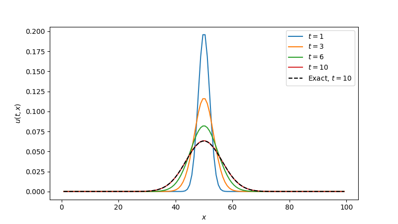

# Solving the heat equation in one dimension

This tutorial demonstrates how to numerically solve an equation of the
form $\partial u / \partial t = f(t, u)$ using `pardax`. It covers
spatial discretisation, the solver pipeline, and implicit time stepping.

## Problem statement

The 1D heat equation is

$$ \frac{\partial u}{\partial t} = D \frac{\partial^2 u}{\partial x^2}, $$

where $D$ is the diffusivity and $u(t, x)$ is the temperature at
position $x$ and time $t$.

We solve on $x \in [0, L]$ with homogeneous Dirichlet boundary
conditions

$$ u(t, 0) = u(t, L) = 0. $$

Starting from a Gaussian centred at $x = L/2$,

$$ u(t_0, x) = \frac{1}{\sqrt{4 \pi D t_0}} \exp\!\left(-\frac{(x - L/2)^2}{4 D t_0}\right), $$

the heat equation has the analytical solution

$$ u(t, x) = \frac{1}{\sqrt{4 \pi D t}} \exp\!\left(-\frac{(x - L/2)^2}{4 D t}\right) $$

for $t \geq t_0$, which we will use to verify the numerical result.

## 1. Spatial discretisation

We use a uniform finite difference grid with $n$ interior points

$$ x_i = i \, \Delta x, \quad i = 1, \ldots, n, $$

where $\Delta x = L / (n + 1)$. The boundary values $u = 0$ at $x = 0$
and $x = L$ are enforced through ghost points in the Laplacian stencil.

```python
import jax
import jax.numpy as jnp

def laplacian_dirichlet_1d(u, bc_left, bc_right, dx):
    """Second-order central difference Laplacian with Dirichlet BCs."""
    dudx = jnp.diff(u, prepend=bc_left, append=bc_right)
    return jnp.diff(dudx) / dx**2

def heat_rhs(t, u, D, bc_left, bc_right, dx):
    """Right-hand side: du/dt = D * d²u/dx²."""
    return D * laplacian_dirichlet_1d(u, bc_left, bc_right, dx)
```

The right-hand side function must have the signature
`(t, u, *args) -> du/dt`. Any additional parameters (`D`, `bc_left`,
etc.) are passed through the `args` tuple when calling `solve_ivp`.

## 2. Parameters and initial condition

```python
# Physical parameters
D = 2.0       # diffusivity
L = 100.0     # domain length
n = 128       # number of interior grid points
dx = L / (n + 1)

# Boundary conditions
bc_left, bc_right = 0.0, 0.0

# Spatial grid (interior points only)
x = jnp.linspace(dx, L - dx, n, endpoint=True)

# Analytical solution (used for IC and verification)
def gaussian(x, t, D, L):
    return jnp.exp(-((x - L/2)**2) / (4*D*t)) / jnp.sqrt(4*jnp.pi*D*t)

# Evaluation times (must include the initial time as first element)
t_eval = jnp.array([1.0, 3.0, 6.0, 10.0])

y0 = gaussian(x, t_eval[0], D, L)
```

## 3. Build the solver and integrate

In `pardax`, implicit time stepping is assembled from composable
components:

1. A **linear solver** (e.g. [GMRES][pardax.GMRES]) solves the linear
   system that arises at each Newton iteration.
2. A **lineariser** (e.g. [AutoJVP][pardax.AutoJVP]) constructs that
   linear system from the nonlinear residual, using automatic
   differentiation or a user-supplied Jacobian.
3. A **root finder** ([NewtonRaphson][pardax.NewtonRaphson]) drives the
   outer Newton iteration to convergence.
4. A **time stepper** ([BackwardEuler][pardax.BackwardEuler]) defines
   the implicit residual and delegates to the root finder.

```python
import pardax as pdx

linsolver = pdx.GMRES(tol=1e-6, maxiter=50)

root_finder = pdx.NewtonRaphson(
    lineariser=pdx.AutoJVP(linsolver=linsolver),
    tol=1e-6,
    maxiter=20,
)

method = pdx.BackwardEuler(root_finder=root_finder)
```

Because backward Euler is unconditionally stable for the heat equation,
we can use a time step much larger than the explicit diffusive CFL
limit $\Delta t \lesssim \Delta x^2 / (2D)$:

```python
dt = 1e-1  # explicit CFL would require dt < ~0.15

t, y = pdx.solve_ivp(
    heat_rhs,
    t_eval,
    y0,
    method,
    dt_max=dt,
    args=(D, bc_left, bc_right, dx),
)
```

## 4. Visualise the results

```python
import matplotlib.pyplot as plt

fig, ax = plt.subplots(figsize=(8, 4.5))

for i in range(len(t_eval)):
    style = ':' if i == 0 else '-'
    ax.plot(x, y[i], style, label=f"$t = {t_eval[i]:.0f}$")

# Overlay exact solution at final time
u_exact = gaussian(x, t_eval[-1], D, L)
ax.plot(x, u_exact, 'k--', label=f"Exact, $t = {t_eval[-1]:.0f}$")

ax.legend()
ax.set_xlabel("$x$")
ax.set_ylabel("$u(t, x)$")
plt.show()
```

