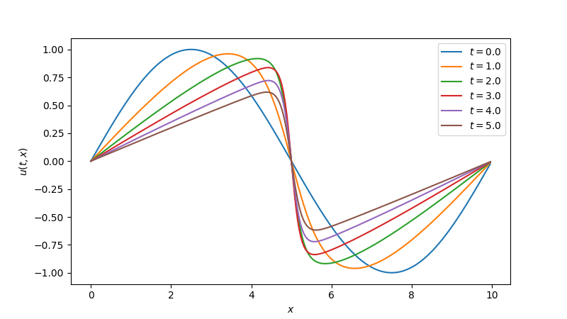

# IMEX spectral solver for Burgers' equation

This is an advanced tutorial demonstrating how to solve Burgers' equation
using an implicit-explicit (IMEX) scheme. The stiff diffusive term is
treated implicitly with a spectral linear solver, while the non-linear
convective term is treated explicitly with RK4.

## Problem statement

The 1D viscous Burgers' equation is

$$ \frac{\partial u}{\partial t} = -u \frac{\partial u}{\partial x} + \nu \frac{\partial^2 u}{\partial x^2}, $$

where $\nu$ is the kinematic viscosity. The equation combines non-linear
advection ($-u \frac{\partial u}{\partial x}$) with linear diffusion 
($\nu \frac{\partial^2 u}{\partial x^2}$), making it a useful
model for understanding shock formation and numerical
stiffness.

We solve on a periodic domain $x \in [0, L)$ with initial condition

$$ u(x, 0) = A \sin(2\pi x / L). $$

## Why IMEX?

A fully explicit method must respect both stability limits:

- Diffusive CFL: $\Delta t \lesssim \Delta x^2 / (2\nu)$
- Advective CFL: $\Delta t \lesssim \Delta x / \max|u|$

On fine grids or for large $\nu$, the diffusive constraint dominates because
it scales as $\Delta x^2$. By treating diffusion implicitly, we
eliminate the diffusive CFL restriction entirely and only need to
satisfy the less restrictive advective CFL condition. In practice, this
typically allows much larger time steps.

## 1. Spatial discretisation

We discretise on a uniform periodic grid with $n$ points and spacing
$\Delta x = L / n$. Both the Laplacian and the first derivative use
second-order central finite differences.

```python
import jax
import jax.numpy as jnp

def diffusion_rhs(t, u, nu, dx):
    """Diffusion: nu * d²u/dx² (periodic, central differences)."""
    return nu * (jnp.roll(u, -1) - 2 * u + jnp.roll(u, 1)) / dx**2

def advection_rhs(t, u, nu, dx):
    """Advection: -u * du/dx (periodic, central differences)."""
    dudx = (jnp.roll(u, -1) - jnp.roll(u, 1)) / (2 * dx)
    return -u * dudx
```

Note that both functions receive the same `args = (nu, dx)` tuple.
The advection term does not use `nu`, but the shared signature is
required by `pardax`'s argument-passing convention.

## 2. Parameters and initial condition

```python
nu = 1e-1       # viscosity
L = 10.0        # domain length
n = 256         # number of grid points
dx = L / n
A = 1.0         # initial amplitude

x = jnp.arange(0, L, dx)
y0 = A * jnp.sin(2 * jnp.pi * x / L)

t_eval = jnp.linspace(0.0, 5.0, 11)
```

## 3. Choosing a spectral transform

The choice of spectral transform is dictated by the boundary conditions.

Since our problem has periodic boundary conditions, we use the
real-valued DFT via `jnp.fft.rfft` / `jnp.fft.irfft`.

In other cases, a discrete cosine or sine transform may be the better choice.

## 4. Constructing the spectral operator and solver

The spectral approach works by diagonalising the discrete Laplacian.
For the second-order central difference stencil on a periodic grid,
the eigenvalues are

$$ \sigma_k = \frac{-4 \sin^2(k \Delta x / 2)}{\Delta x^2}, $$

where $k = 2\pi m / L$ are the discrete wavenumbers. The implicit
system at each time step is $(I - h \nu \sigma_k)\hat{u}_k = \hat{b}_k$,
which reduces to a pointwise division in Fourier space.

In `pardax`, this is split into two components:

- A [SpectralOperator][pardax.SpectralOperator] that holds the
  eigenvalues $\nu \sigma_k$ and builds the spectral symbol
  $1 - h \nu \sigma_k$ at each time step.
- A [SpectralSolver][pardax.SpectralSolver] that owns the forward
  and inverse transforms and performs the pointwise solve.

```python
import pardax as pdx

# Wavenumbers for a real-valued periodic signal
k = 2 * jnp.pi * jnp.fft.rfftfreq(n, d=dx)

# Eigenvalues of the discrete Laplacian (including viscosity)
sigma = -4 * nu * jnp.sin(k * dx / 2)**2 / dx**2

operator = pdx.SpectralOperator(eigvals=sigma)

solver = pdx.SpectralSolver(
    forward=jnp.fft.rfft,
    backward=lambda x: jnp.fft.irfft(x, n=n),
)
```

## 5. Assembling the IMEX stepper

The [IMEX][pardax.IMEX] stepper composes an explicit and an implicit
sub-stepper. The implicit part uses
[BackwardEuler][pardax.BackwardEuler] with a
[LinearRootFinder][pardax.LinearRootFinder] that pairs the spectral
operator and solver from above.

```python
root_finder = pdx.LinearRootFinder(
    linsolver=solver,
    operator=operator,
)

stepper = pdx.IMEX(
    explicit=pdx.RK4(),
    implicit=pdx.BackwardEuler(root_finder=root_finder),
)
```

The right-hand side is passed to `solve_ivp` as a dict:

```python
rhs = {
    "explicit": advection_rhs,
    "implicit": diffusion_rhs,
}
```

## 6. Solve and visualise

```python
dt = 0.8 * dx / A  # advective CFL

t, y = pdx.solve_ivp(rhs, t_eval, y0, stepper, dt_max=dt, args=(nu, dx))
```

```python
import matplotlib.pyplot as plt

fig, ax = plt.subplots(figsize=(8, 4.5))
for i in range(0, len(t_eval), 2):
    ax.plot(x, y[i], label=f"$t = {t_eval[i]:.1f}$")
ax.set_xlabel("$x$")
ax.set_ylabel("$u(t, x)$")
ax.legend()
plt.show()
```

